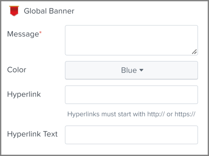

## Global Banner Alert Action: Update Splunk's Global Banner Based On Search Results

This repo includes a Splunk app and a custom alert action.  
The main goal of this alert action is to update Splunk's Global Banner as a result of a scheduled search.  
This alert action is designated for the system's admins to use in times when a message is to be displayed to __all__ users, for example a general outage that would affect performance.  

---

### Fields to fill up when using this alert action
1. The action <ins>requires</ins> 1  input:
    * `Message` - Banner notification text.

2. The action can also accept 3 <ins>optional</ins> inputs:
    * `background_color` - Indicates the color of the banner: [green | blue | yellow | orange | red | `$result.color$`].  
     --> `$result.color$` is used for assigning dynamic values based on search results. __Default: blue__.
    * `hyperlink` - The link included in the banner, must start with `http://` or `https://`.
    * `hyperlink_text` - Display text for the link in the banner.
---

### Notes:
- To use the alert action, the user must be __admin__ or either be assigned with the `can_edit_global_banner` role. (see [authorize.conf](https://github.com/doronkg/alert_global_banner/blob/master/default/authorize.conf)).
- Only __one__ Global Banner could be displayed at a given time.
- The Global Banner will be displayed until it reaches its `expiration_timeout` which derives from the field `$alert.expires$`. __Default: 24h__ (also the max time, longer than that the action is killed).

